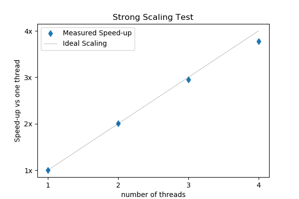

# parallel_primes_rs
A command-line program that finds all primes between two numbers passed to it in the command line.

## Overview
This is a parallelized Rust program where you can pass it two integers and it will print a vector of all
of the primes between the two integers (inclusive) to standard out. It is parallelized and you can change
the number of threads with the -N option

For example
```bash
$ ./primes_cli 10 19
```
prints
```bash
[11, 13, 17, 19]
```

The algorithm to determine if a number is prime is naïve brute force, with some care to avoid overflow errors.
It uses a work-stealing threadpool provided by `rayon` and the default is to set the number of threads equal
to the number of physical cores available, but you can change this by calling e.g.

```
$ ./primes_cli -N 1 10 19
```

More info can be found by typing
```bash
$ ./primes_cli -h
```

## Building parallel_primes_rs

This program uses a typical rust project structure containing library `./src/lib.rs` and a binary file `./src/bin.rs`. To build
the program run `cargo build --release` and you will create an executable at `./target/release/primes_cli`

You can also run the automated tests by running `cargo test --release`

## Strong Scaling Test

Because this problem is embarassingly parallel & compute bound, we should expect the program to scale nearly ideally (~num of threads) as long
as each thread can have its own core. There is a little bit of a subtlety because if you actually print the output to the terminal, you may become
I/O bound. So to test scaling, I commented out the line in `bin.rs` that prints to stdout, and timed the code e.g., `$ time ./primes_cli -N 1 2000000 5000000`
on my macbook with a 2.5 GHz Quad-Core Intel Core i7, changing number of threads from 1 to 4. The results are plotted below



As you can see, the problem scales nearly ideally.

## Dependencies
- [clap](https://docs.rs/clap/) for arg parsing.
- [rayon](https://docs.rs/rayon/) for parallelization.
- [anyhow](https://docs.rs/anyhow) for nicer error handling.
